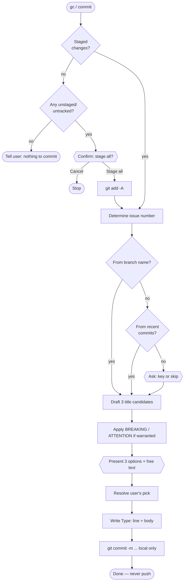

# git-commit

Create a git commit with an issue-number prefix and a conventional-commits body, offering 3
title candidates to pick from. Triggered by "gc" / "commit".

## Flow

```mermaid
flowchart TD
    start([gc / commit]) --> staged{Staged<br/>changes?}
    staged -- no --> changes{Any unstaged/<br/>untracked?}
    changes -- no --> nothing([Tell user: nothing to commit])
    changes -- yes --> confirm{{Confirm: stage all?}}
    confirm -- Cancel --> stop([Stop])
    confirm -- Stage all --> add[git add -A]
    add --> issue
    staged -- yes --> issue[Determine issue number]

    issue --> branch{From branch name?}
    branch -- yes --> titles
    branch -- no --> history{From recent<br/>commits?}
    history -- yes --> titles
    history -- no --> ask{{Ask: key or skip}}
    ask --> titles[Draft 3 title candidates]

    titles --> marker[Apply BREAKING / ATTENTION if warranted]
    marker --> present{{Present 3 options + free text}}
    present --> pick[Resolve user's pick]
    pick --> body[Write Type: line + body]
    body --> commit[git commit -m ... local only]
    commit --> done([Done — never push])
```
