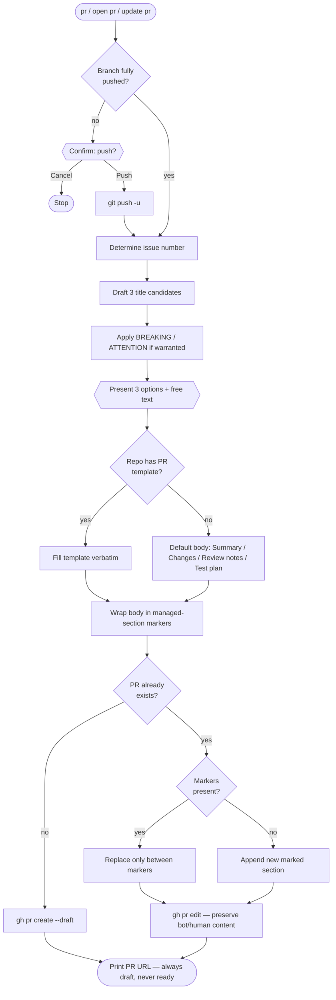

# github-pr

Open or update a GitHub pull request with an issue-prefixed title and a reviewer-focused
body, defaulting to a draft. Triggered by "pr" / "open a pr" / "update the pr".

## Flow

```mermaid
flowchart TD
    start([pr / open pr / update pr]) --> pushed{Branch fully<br/>pushed?}
    pushed -- no --> confirm{{Confirm: push?}}
    confirm -- Cancel --> stop([Stop])
    confirm -- Push --> push[git push -u]
    push --> issue
    pushed -- yes --> issue[Determine issue number]

    issue --> titles[Draft 3 title candidates]
    titles --> marker[Apply BREAKING / ATTENTION if warranted]
    marker --> present{{Present 3 options + free text}}
    present --> tmpl{Repo has PR<br/>template?}
    tmpl -- yes --> fill[Fill template verbatim]
    tmpl -- no --> default[Default body: Summary / Changes / Review notes / Test plan]
    fill --> wrap
    default --> wrap[Wrap body in managed-section markers]

    wrap --> exists{PR already<br/>exists?}
    exists -- no --> create[gh pr create --draft]
    exists -- yes --> markers{Markers<br/>present?}
    markers -- yes --> refresh[Replace only between markers]
    markers -- no --> append[Append new marked section]
    refresh --> edit[gh pr edit — preserve bot/human content]
    append --> edit
    create --> done([Print PR URL — always draft, never ready])
    edit --> done
```
