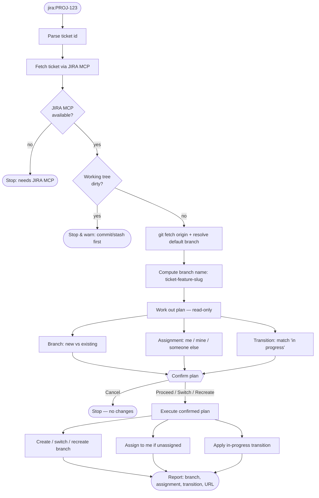

# jira-start

Start work on a JIRA ticket: fetch it, branch off the latest base, and self-assign + move to
in-progress — all behind one confirmation. Triggered by "jira:<PROJ-123>" / "start jira
task: <PROJ-123>".

## Flow

